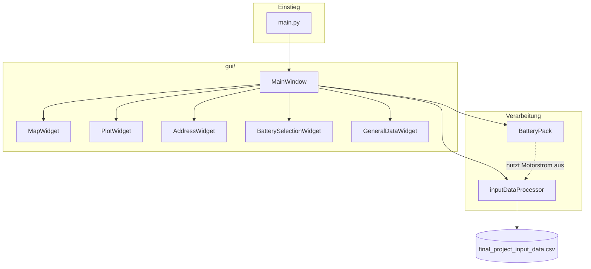
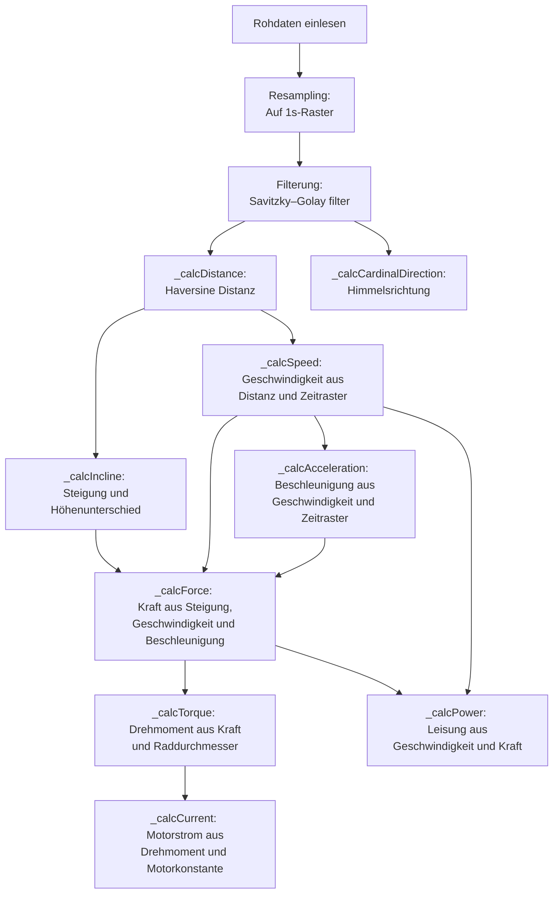
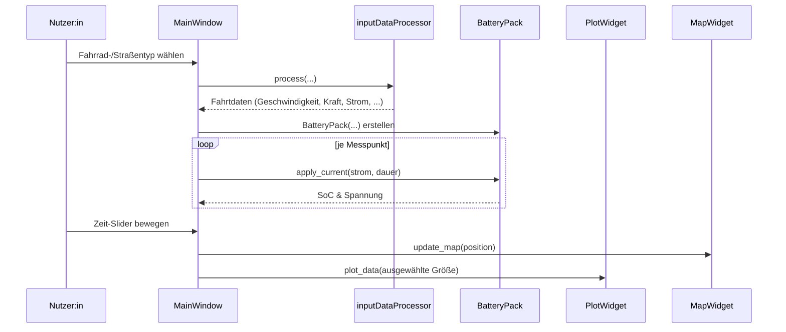

# MCI - Programmieren II - 2026

Abschlussprojekt für Programmieren II am MCI Innsbruck im Bachelor Studiengang Mechatronik.

Die Anwendung ist eine **E-Bike-Akkusimulation**: Aus aufgezeichneten GPS-/Höhen-/Temperaturdaten einer Fahrt werden physikalische Größen (Geschwindigkeit, Steigung, Kraft, Drehmoment, Motorstrom, Leistung) berechnet und darauf aufbauend der Ladezustand sowie die Spannung eines simulierten Akkupacks über den Fahrtverlauf ermittelt. Die Ergebnisse werden in einer PySide6-Desktop-GUI mit Karte, Diagrammen und Kennzahlen dargestellt.

---

## Installationsanleitung

**Voraussetzungen**

- Python 3.14.3
- pip 26.1.2 
- Internetzugang
- Git

<br>

 **1. Repository klonen**

```bash
git clone https://github.com/LukasJuergens/MCI-Programmieren-II---2026.git
```

**2. Virtuelle Umgebung anlegen (optional)**

```bash
python -m venv .venv
.venv\Scripts\activate
```

**3. Abhängigkeiten installieren**

```bash
pip install -r requirements.txt
```

**4. Anwendung starten**

```bash
python main.py
```

**In der Anwendung**

1. Verwendetes Fahrrad und Hauptstraßenbelag auswählen
2. Akkutyp auswählen und Zellkapazität eingeben 
3. Mit dem Slider können die Strecke und der Graph zugeschnitten werden
4. Über dem Graph können die angezeigten Daten ausgewählt werden


---

## Dokumentation

### Überblick

Die Software gliedert sich in drei Bereiche:

1. **Datenaufbereitung** (`inputDataProcessor.py`) – liest die Rohdaten ein, filtert und berechnet daraus technische Größen
2. **Akkumodell** (`Battery_Pack.py`) – simuliert Ladezustand und Spannung eines Akkupacks basierend auf dem berechneten Motorstrom.
3. **GUI** (`gui/`) – stellt die Ergebnisse interaktiv dar (Karte, Diagramme, Kennzahlen, Auswahlmöglichkeiten für Fahrrad-/Akkuparameter).

### Softwarestruktur

#### Modul- und Klassenübersicht



#### Datenverarbeitung - `inputDataprocessor.py`



#### GUI - `gui/`(vereinfacht)




### Klassen im Detail

| Klasse                   | Datei                             | Aufgabe                                                                                                                                                                                                                                                      |
| ------------------------ | --------------------------------- | ------------------------------------------------------------------------------------------------------------------------------------------------------------------------------------------------------------------------------------------------------------ |
| `inputDataProcessor`     | `inputDataProcessor.py`           | Liest die GPS-Daten ein, resampled und filtert sie und berechnet Distanz, Steigung, Geschwindigkeit, Beschleunigung, Kraft, Drehmoment, Motorstrom und Leistung.                                                                                             |
| `BatteryPack`            | `Battery_Pack.py`                 | Akkusimulationsmodell aus [09 \| 2. Einführung in die OOP - Übung](https://mrp123.github.io/MCI-MECH-B-2-PRO1-PRO1-ILV/lectures/09_oop/2_oop_uebung.html) mit einer Erweiterung zur Berechnung der minimalen Kapazität, welche für die Strecke benötigt wird |
| `MainWindow`             | `gui/main_window.py`              | Zentrales Fenster; verbindet Nutzereingaben mit `inputDataProcessor.py` und `Battery_Pack.py` und steuert alle Unter-Widgets                                                                                                                                 |
| `MapWidget`              | `gui/map_widget.py`               | Zeigt die gefahrene Route auf einer folium-Karte an                                                                                                                                                                                                          |
| `PlotWidget`             | `gui/plot_widget.py`              | Dartstellung der in `inputDataProcessor.py` berechneten Zeitreihen                                                                                                                                                                                           |
| `AddressWidget`          | `gui/address_widget.py`           | Löst GPS-Koordinaten über `geopy`/Nominatim in eine lesbare Adresse auf                                                                                                                                                                                      |
| `BatterySelectionWidget` | `gui/battery_selection_widget.py` | Eingabe von Akkutyp und Zellkapazität sowie Anzeige der daraus resultierenden minimalen Zellenanzahl                                                                                                                                                         |
| `GeneralDataWidget`      | `gui/general_data_widget.py`      | Zeigt Kennzahlen der gesamten Fahrt an (Distanz, Durchschnittsgeschwindigkeit, Höhenmeter, maximale Leistung, Gesamtzeit)                                                                                                                                    |

### Quellen

- **Kartenmaterial:** [OpenStreetMap](https://www.openstreetmap.org/) über die Bibliothek [folium](https://python-visualization.github.io/folium/).
- **Adressauflösung (Reverse Geocoding):** [Nominatim](https://nominatim.org/) über die Bibliothek [geopy](https://geopy.readthedocs.io/).
- **Himmelsrichtungsberechnung:** [osmnx](https://osmnx.readthedocs.io/) 
- **Luftdichteberechnung (für Luftwiderstand):** [MetPy](https://unidata.github.io/MetPy/) 
- **Glättung der Rohdaten:** Savitzky-Golay-Filter aus [scipy.signal](https://docs.scipy.org/doc/scipy/reference/generated/scipy.signal.savgol_filter.html).
- **Distanzberechnung - Haversine-Formel:** [GeeksForGeeks](https://www.geeksforgeeks.org/dsa/haversine-formula-to-find-distance-between-two-points-on-a-sphere/)
- **GUI-Framework:** [PySide6](https://doc.qt.io/qtforpython/) (Qt for Python).
- **Diagrammdarstellung:** [matplotlib](https://matplotlib.org/).

### Ausgeführte Erweiterungen

- [x] Plotten von diversesten hilfreichen Darstellungen
- [x] Alle commit-messages im `github`-Repository sollen dem Konzept der [Conventional Commits](https://www.conventionalcommits.org/en/v1.0.0/) folgen, um die Nachvollziehbarkeit der Entwicklung zu gewährleisten 
- [x] Plotten der Strecke auf einer Karte (z.B. mit `folium` oder `geopandas`)
- [ ] Unit-Tests für sinnvolle Teile der Software
- [ ] Durchführen von automatischen Parameterstudien mit:
    - Reifendurchmesser, Masse des Fahrers/Fahrrads, Luftwiderstandsbeiwert, etc
- [x] Bestimmung der Luftdichte aus Temperatur und Höhe über dem Meeresspiegel
- [x] Simulation des Rollwiderstands
- [ ] Simulation der Akkutemperatur und deren Einfluss auf die Akkuleistung
- [ ] Simulation eines Bremswiderstands, der “überschüssige” Energie dissipiert, wenn sie nicht mehr in den Akku geladen werden kann
- [x] Nutzen einer API um die GPS-Koordinaten in Adressen/Orte umzuwandeln (Reverse Geocoding) und diese in Plots darzustellen
- [ ] Aufrufen von Wetterdaten für die Zeitpunkte der Fahrt und Berücksichtigung von Wind, etc.
- [x] Bestimmung der Orientierung (Himmelsrichtung) aus den GPS-Daten
- [ ] Generieren eines Reports über die Fahrt mit den wichtigsten Kenngrößen, Plots, etc. → z.B. als LATEX-Dokument
